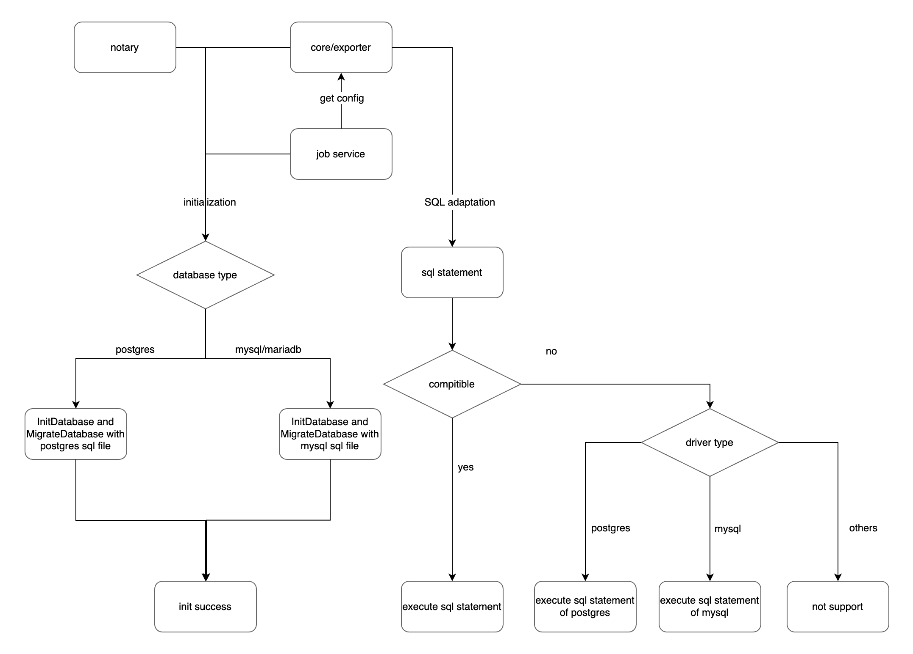

# Proposal: `Adapt Multiple Type of Database for Harbor`

Author:

- Yvonne [@JinXingYoung](https://github.com/JinXingYoung)
- Yiyang Huang [@hyy0322](https://github.com/hyy0322)
- Minglu []()
- De Chen [@cd1989](https://github.com/cd1989)

Links:

- Previous Discussion: [goharbor/harbor#6534](https://github.com/goharbor/harbor/issues/6534)
- Related PR from Others Before: [goharbor/harbor#14265](https://github.com/goharbor/harbor/pull/14265)

## Abstract

Propose to support other databases in Harbor, the first step is to support MySQL/MariaDB. This proposal introduces an abstract DAO layer in Harbor, different database can have their drivers to implement the interface. So that Harbor can adapt to other databases as long as a well tested database driver provided.


## Background

As previous discussion([goharbor/harbor#6534](https://github.com/goharbor/harbor/issues/6534)) shown, there are certain amount of users(especially in China) lack the experiences of maintaining PostgreSQL for HA, disaster recovery, etc. And meanwhile they are more familiar with other databases such as MySQL/MariaDB. They prefer to use MariaDB/MySQL instead of PostgreSQL to keep their production environments stable.

As we all know that Harbor used MySQL before. But scanner clair use PostgreSQL as database. In order to keep consistency with clair and reduce maintenance difficulties. Harbor unified database using PostgreSQL.

Since Harbor v2.0 use trivy as default scanner instead of clair，there's no strongly requirement to use PostgreSQL anymore. Therefore, it is possible to adapt different kind of database now.

## Proposal

Support other databases in Harbor other than PostgreSQL.

### Goals

- Keep using PostgreSQL as default database. The Implementation will be compatible with current version of Harbor.
- Abstract DAO layer for different type of databases.
- Support MariaDB(10.5.9), MySQL(8.0) by implementing corresponding drivers and resolving sql compatibility.
- Provide migration tool or guide for users to migrate data from PostgreSQL to MariaDB/MySQL.

### Non-Goals

- Support other type of database, such as MongoDB, Oracle.
- Implement Mariadb/MySQL operator for internal database case.

## Implementation

### Overview


### Component Detail

**Core/JobService/Exporter/Notary** 



### Database Compatibility Testing

**MySQL 8.0**

sql file | Compatibility test | comment
------------|------------|------------
 | 0001_initial_schema.up.sql | Pass | xxx
 | 0002_1.7.0_schema.up.sql | Pass | xxx
 | 0003_add_replication_op_uuid.up.sql | Pass | xxx 
 | 0004_1.8.0_schema.up.sql | Pass | xxx 
 | 0005_1.8.2_schema.up.sql | Pass | xxx 
 | 0010_1.9.0_schema.up.sql | Pass | xxx 
 | 0011_1.9.1_schema.up.sql | Pass | xxx 
 | 0012_1.9.4_schema.up.sql | Pass | xxx 
 | 0015_1.10.0_schema.up.sql | Pass | xxx 
 | 0030_2.0.0_schema.up.sql | Pass | xxx 
 | 0031_2.0.3_schema.up.sql | Pass | xxx 
 | 0040_2.1.0_schema.up.sql | Pass | xxx 
 | 0041_2.1.4_schema.up.sql | Pass | xxx 
 | 0050_2.2.0_schema.up.sql | Pass | xxx 
 | 0051_2.2.1_schema.up.sql | Pass | xxx 
 | 0052_2.2.2_schema.up.sql | Pass | xxx 
 | 0053_2.2.3_schema.up.sql | Pass | xxx 
 | 0060_2.3.0_schema.up.sql | Pass | xxx 
 | 0061_2.3.4_schema.up.sql | Pass | xxx 
 | 0070_2.4.0_schema.up.sql | Pass | xxx 
 | 0071_2.4.2_schema.up.sql | Pass | xxx 
 | 0080_2.5.0_schema.up.sql | Pass | xxx 

**MariaDB 10.5.9**

sql file | Compatibility test | comment
------------|------------|------------
 | 0001_initial_schema.up.sql | Pass | xxx
 | 0002_1.7.0_schema.up.sql | Pass | xxx
 | 0003_add_replication_op_uuid.up.sql | Pass | xxx 
 | 0004_1.8.0_schema.up.sql | Pass | xxx 
 | 0005_1.8.2_schema.up.sql | Pass | xxx 
 | 0010_1.9.0_schema.up.sql | Pass | xxx 
 | 0011_1.9.1_schema.up.sql | Pass | xxx 
 | 0012_1.9.4_schema.up.sql | Pass | xxx 
 | 0015_1.10.0_schema.up.sql | Pass | xxx 
 | 0030_2.0.0_schema.up.sql | Pass | xxx 
 | 0031_2.0.3_schema.up.sql | Pass | xxx 
 | 0040_2.1.0_schema.up.sql |  | xxx 
 | 0041_2.1.4_schema.up.sql | Pass | xxx 
 | 0050_2.2.0_schema.up.sql | Pass | xxx 
 | 0051_2.2.1_schema.up.sql | Pass | xxx 
 | 0052_2.2.2_schema.up.sql | Pass | xxx 
 | 0053_2.2.3_schema.up.sql | Pass | xxx 
 | 0060_2.3.0_schema.up.sql | Pass | xxx 
 | 0061_2.3.4_schema.up.sql | Pass | xxx 
 | 0070_2.4.0_schema.up.sql | Pass | xxx 
 | 0071_2.4.2_schema.up.sql | Pass | xxx 
 | 0080_2.5.0_schema.up.sql | Pass | xxx 

### How To Use

Users can configure database type to use Mariadb/MySQL in external_database mode, PostgreSQL is used by default.

Set harbor_db_type configuration under external_database and db type under notary db configuration:
```
# Uncomment external_database if using external database.
# external_database:
#   harbor:
#     # database type, default is postgresql, options include postgresql, mariadb and mysql
#     type: harbor_db_type
#     host: harbor_db_host
#     port: harbor_db_port
#     ...
#   notary_signer:
#     type: notary_signer_db_type
#     host: notary_signer_db_host
#     port: notary_signer_db_port
#     ...
#   notary_server:
#     type: notary_server_db_type
#     host: notary_server_db_host
#     port: notary_server_db_port
#     ...
```

## Rationale

### Migration

#### Write a document Using official migration tool

MySQL community provide a [tool](https://dev.mysql.com/doc/workbench/en/wb-migration-database-postgresql.html) to migrate data.(Need further test)

#### Write a script to migrate data.

1. Define data models for postgreSQL and MariaDB/MySQL.
2. Read data from postgreSQL and map to data model.
3. Transfer postgreSQL data model to MariaDB/MySQL data model.
4. Write data to MariaDB/MySQL database
